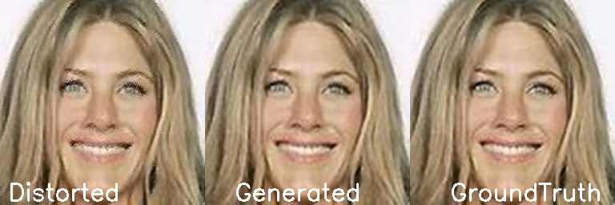
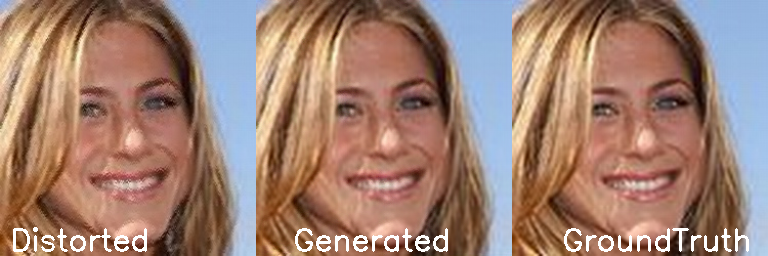

## Image Denoising GAN 

The task was, given a set of degraded images, degraded using some unknown function, one has to build a GAN to fix the images and bring them as closer to the ground truth as possible.

### Generator Architecture
The generator is having a ResNet like architecture with skip connections of length 3. Each residual block consists of 3 convoltion blocks activated using LeakyReLU.

### Discriminator Architecture
The discriminator network is having a VGG like architecture having Convolutions, Batch Norm activated with LeakyReLU

### Loss Function Used
The loss function of the generator consists of a linear combination 3 losses.
Adversarial component of the generator equation
Pixelwise MSE with respect to the ground truth
L1 Perceptual loss on features obtained from VGG16 model

### Solution Implemented
Trained the model on a compound loss function consisting of pixelwise loss, feature loss obtained using a pretrained VGG16 model, and finally the adversarial loss. Training enabled faster with different values of learning rates of discriminator and Generator

Evaluation Metric Used: Peak signal to Noise Ratio (PSNR)

### Sample

